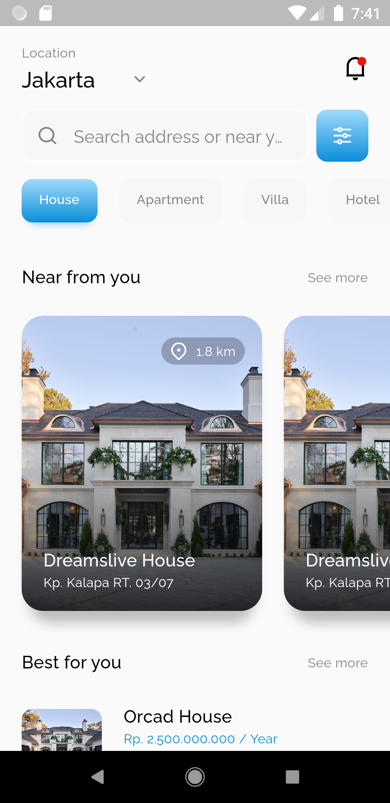
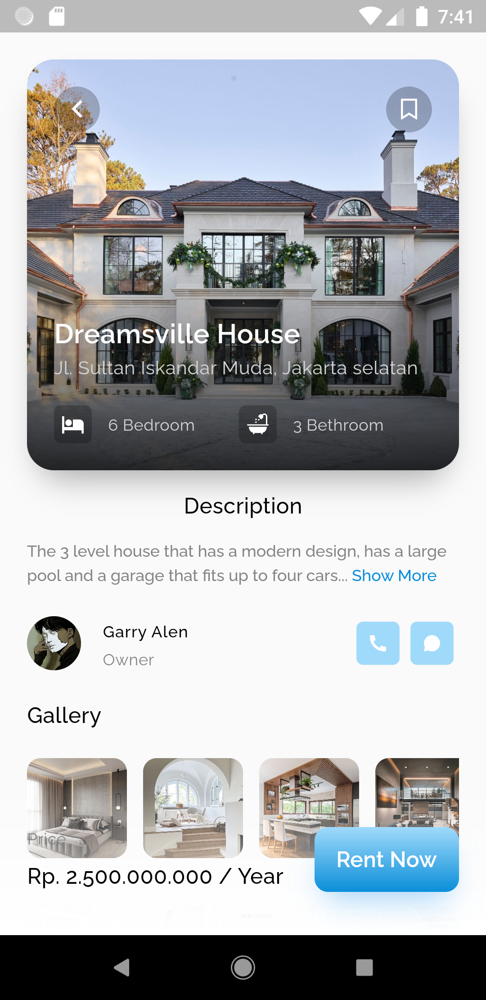
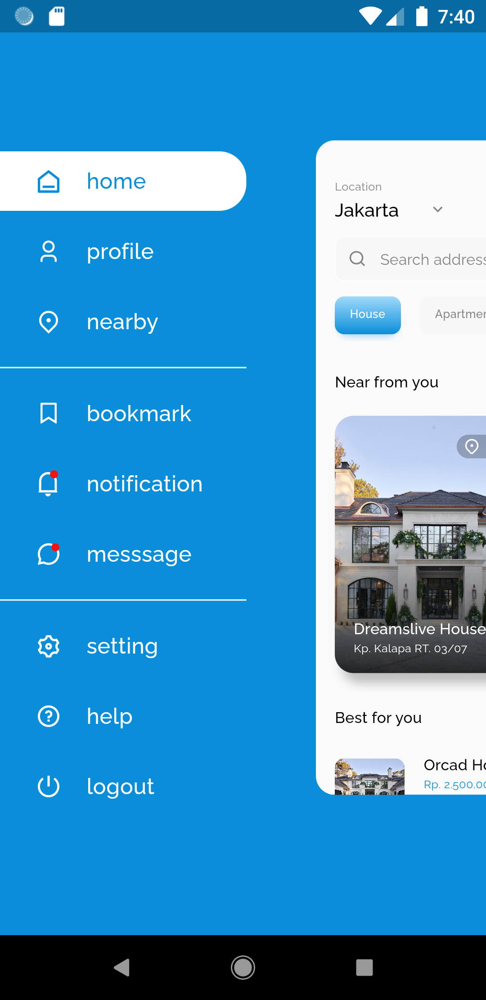

# Decription

This project is a project created to learning UI flutter.
In this application only displays 3 screens, namely:

- Home to display a list of the house that will be sold.
- Details to display details from home.
- Menu to display features options in the application.

The package used:

- [flutter_svg: ^2.0.7](https://pub.dev/packages/flutter_svg)
- [flutter_zoom_drawer: ^3.1.1](https://pub.dev/packages/flutter_zoom_drawer)
- [google_fonts: ^5.0.0](https://pub.dev/packages/google_fonts)
- [provider: ^6.0.5](https://pub.dev/packages/provider)

# Screenshot

### Home

### Detail

### Menu

